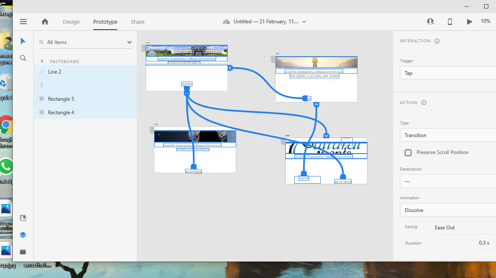
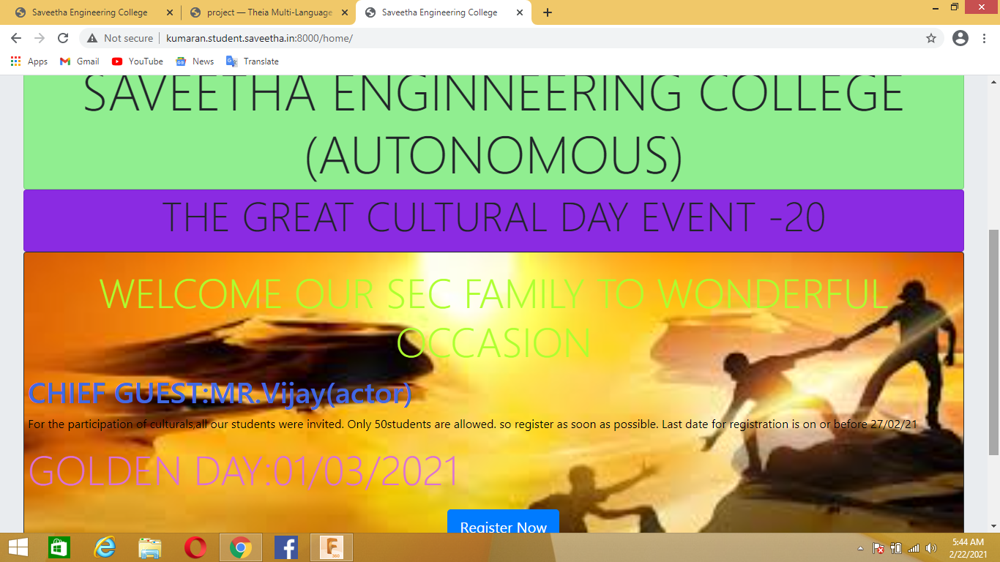
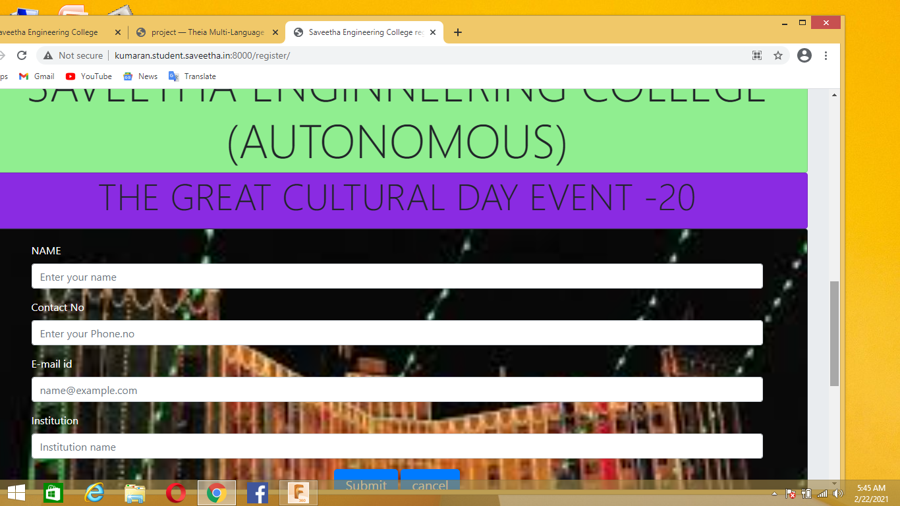
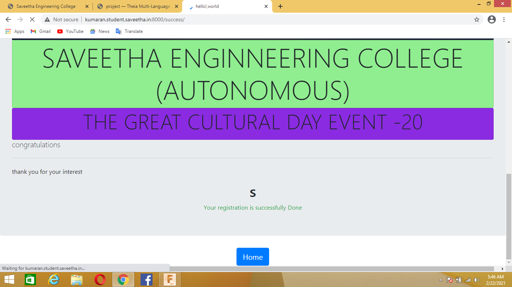
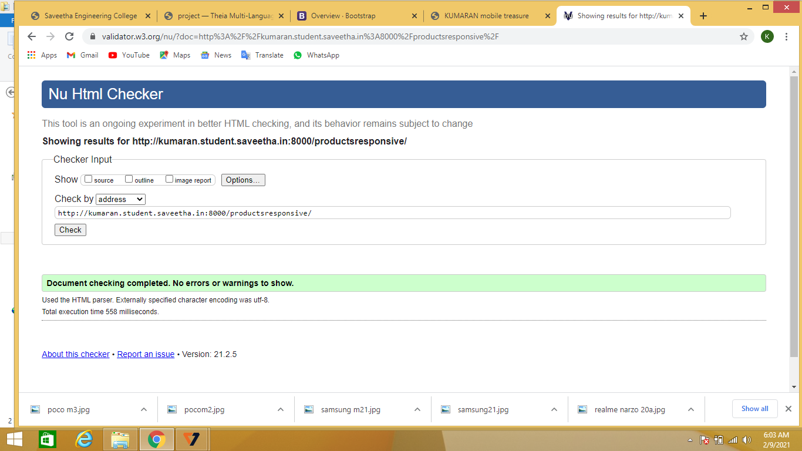

# WebApplication for Event Registration

## AIM:
To create a UX design and develop a web application for event registration.
## DESIGN STEPS:


## DESIGN SCREENS:


## WIREFRAME:



## PROTOTYPE:


## PROGRAM:
###home.html
```<!doctype html>
<html lang="en">

<head>
    <!-- Required meta tags -->
    <meta charset="utf-8">
    <meta name="viewport" content="width=device-width, initial-scale=1, shrink-to-fit=no">

    <!-- Bootstrap CSS -->
    <link rel="stylesheet" href="https://stackpath.bootstrapcdn.com/bootstrap/4.1.3/css/bootstrap.min.css"
        integrity="sha384-MCw98/SFnGE8fJT3GXwEOngsV7Zt27NXFoaoApmYm81iuXoPkFOJwJ8ERdknLPMO" crossorigin="anonymous">

    <title>Saveetha Engineering College</title>
</head>

<body>
    <div class="jumbotron">
        
        <div class="card" style="background-color:lightgreen">
        <h1 class="display-3 text-center">SAVEETHA ENGINNEERING COLLEGE (AUTONOMOUS)</h1>
        </div>
        </img>
        <div class="card" style="background-color:blueviolet">
        <p class="display-4 text-center">THE GREAT CULTURAL DAY EVENT -20</p>
    </div>
    <div class="card bg-dark text-white">
        
        <div class="card-img-overlay" class="text-center">
            <div class="row">
            <h5 class="card-title display-4 text-center" style="color:greenyellow">WELCOME OUR SEC FAMILY TO WONDERFUL OCCASION</h5>
            <h1 class="card-text display-5 text-center" style="color:royalblue">CHIEF GUEST:MR.Vijay(actor)</h1>
            <p class="card-text display-5 text-center" style="color:black">For the participation of culturals,all our students were invited. Only 50students are allowed. so register as soon as possible. Last date for registration is on or before 27/02/21 </p>
            <h2 class="card-text display-4 text-center" style="color:orchid">GOLDEN DAY:01/03/2021</h2>
            <div class="row" style="padding-top: 7%; padding-right: 10%;">
                <a href="/register/"class="btn btn-primary btn-lg" role="button" aria-pressed="true">Register Now</a></div>
            
            </div>
        </div>
    </div>

    <!-- Optional JavaScript -->
    <!-- jQuery first, then Popper.js, then Bootstrap JS -->
    <script src="https://code.jquery.com/jquery-3.3.1.slim.min.js"
        integrity="sha384-q8i/X+965DzO0rT7abK41JStQIAqVgRVzpbzo5smXKp4YfRvH+8abtTE1Pi6jizo"
        crossorigin="anonymous"></script>
    <script src="https://cdnjs.cloudflare.com/ajax/libs/popper.js/1.14.3/umd/popper.min.js"
        integrity="sha384-ZMP7rVo3mIykV+2+9J3UJ46jBk0WLaUAdn689aCwoqbBJiSnjAK/l8WvCWPIPm49"
        crossorigin="anonymous"></script>
    <script src="https://stackpath.bootstrapcdn.com/bootstrap/4.1.3/js/bootstrap.min.js"
        integrity="sha384-ChfqqxuZUCnJSK3+MXmPNIyE6ZbWh2IMqE241rYiqJxyMiZ6OW/JmZQ5stwEULTy"
        crossorigin="anonymous"></script>
</body>

</html>
```
### register.html
```
<!doctype html>
<html lang="en">

<head>
    <!-- Required meta tags -->
    <meta charset="utf-8">
    <meta name="viewport" content="width=device-width, initial-scale=1, shrink-to-fit=no">

    <!-- Bootstrap CSS -->
    <link rel="stylesheet" href="https://stackpath.bootstrapcdn.com/bootstrap/4.1.3/css/bootstrap.min.css"
        integrity="sha384-MCw98/SFnGE8fJT3GXwEOngsV7Zt27NXFoaoApmYm81iuXoPkFOJwJ8ERdknLPMO" crossorigin="anonymous">

    <title>Saveetha Engineering College register</title>
</head>

<body>
    <div class="jumbotron">
        
        <div class="card" style="background-color:lightgreen">
            <h1 class="display-3 text-center">SAVEETHA ENGINNEERING COLLEGE (AUTONOMOUS)</h1>
        </div>
        </img>
        <div class="card" style="background-color:blueviolet">
            <p class="display-4 text-center">THE GREAT CULTURAL DAY EVENT -20</p>
        </div>
        <form>
            <div class="card bg-dark text-white">
                
                <div class="card-img-overlay" class="text-center">
                    <div class="container">
                        <div class="form-group">
                            <label for="username">NAME</label>
                            <input type="text" class="form-control" id="username" placeholder="Enter your name">
                        </div>
                        <div class="form-group">
                            <label for="phone">Contact No</label>
                            <input type="text" class="form-control" id="phone" placeholder="Enter your Phone.no">
                        </div>
                        <div class="form-group">
                            <label for="email">E-mail id</label>
                            <input type="email" class="form-control" id="email" placeholder="name@example.com">
                        </div>
                        <div class="form-group">
                            <label for="Institution">Institution</label>
                            <input type="text" class="form-control" id="Institution" placeholder="Institution name">
                        </div>
                        <div class="col-12 text-center">
                            <a href="/success/" class="btn btn-primary btn-lg" role="button"
                                aria-pressed="true">Submit</a>
                            <a href="/home/" class="btn btn-primary btn-lg" role="button" aria-pressed="true">cancel</a>
                        </div>
                    </div>
                </div>
            </div>    
        </form>

        <!-- Optional JavaScript -->
        <!-- jQuery first, then Popper.js, then Bootstrap JS -->
        <script src="https://code.jquery.com/jquery-3.3.1.slim.min.js"
            integrity="sha384-q8i/X+965DzO0rT7abK41JStQIAqVgRVzpbzo5smXKp4YfRvH+8abtTE1Pi6jizo"
            crossorigin="anonymous"></script>
        <script src="https://cdnjs.cloudflare.com/ajax/libs/popper.js/1.14.3/umd/popper.min.js"
            integrity="sha384-ZMP7rVo3mIykV+2+9J3UJ46jBk0WLaUAdn689aCwoqbBJiSnjAK/l8WvCWPIPm49"
            crossorigin="anonymous"></script>
        <script src="https://stackpath.bootstrapcdn.com/bootstrap/4.1.3/js/bootstrap.min.js"
            integrity="sha384-ChfqqxuZUCnJSK3+MXmPNIyE6ZbWh2IMqE241rYiqJxyMiZ6OW/JmZQ5stwEULTy"
            crossorigin="anonymous"></script>
</body>

</html>
```

### success
```
<!doctype html>
<html lang="en">

<head>
    <!-- Required meta tags -->
    <meta charset="utf-8">
    <meta name="viewport" content="width=device-width, initial-scale=1, shrink-to-fit=no">

    <!-- Bootstrap CSS -->
    <link rel="stylesheet" href="https://maxcdn.bootstrapcdn.com/bootstrap/4.0.0/css/bootstrap.min.css"
        integrity="sha384-Gn5384xqQ1aoWXA+058RXPxPg6fy4IWvTNh0E263XmFcJlSAwiGgFAW/dAiS6JXm" crossorigin="anonymous">

    <title>hello!,world</title>
</head>

<body>
    <div class="jumbotron">
        
        <div class="card" style="background-color:lightgreen">
            <h1 class="display-3 text-center">SAVEETHA ENGINNEERING COLLEGE (AUTONOMOUS)</h1>
        </div>
        </img>
        <div class="card" style="background-color:blueviolet">
            <p class="display-4 text-center">THE GREAT CULTURAL DAY EVENT -20</p>
        </div>

        <h1 class="lead">congratulations</h1>
        <hr class="my-4">
        <p>thank you for your interest</p>
        


        <div class="container">
            <div class="row">
                <div class="col-12 text-center">
                    <h1>s</h1>
                </div>
            </div>
            <div class="row">
                <div class="col-12 text-center text-success">
                    Your registration is successfully Done
                </div>
            </div>
        </div>
    </div>
    <div class="row">
        <div class="col-12 text-center">
            <a href="/home/" class="btn btn-primary btn-lg" role="button">Home</a>
        </div>
    </div>
    </div>

    <!-- Optional JavaScript -->
    <!-- jQuery first, then Popper.js, then Bootstrap JS -->
    <script src="https://code.jquery.com/jquery-3.2.1.slim.min.js"
        integrity="sha384-KJ3o2DKtIkvYIK3UENzmM7KCkRr/rE9/Qpg6aAZGJwFDMVNA/GpGFF93hXpG5KkN"
        crossorigin="anonymous"></script>
    <script src="https://cdnjs.cloudflare.com/ajax/libs/popper.js/1.12.9/umd/popper.min.js"
        integrity="sha384-ApNbgh9B+Y1QKtv3Rn7W3mgPxhU9K/ScQsAP7hUibX39j7fakFPskvXusvfa0b4Q"
        crossorigin="anonymous"></script>
    <script src="https://maxcdn.bootstrapcdn.com/bootstrap/4.0.0/js/bootstrap.min.js"
        integrity="sha384-JZR6Spejh4U02d8jOt6vLEHfe/JQGiRRSQQxSfFWpi1MquVdAyjUar5+76PVCmYl"
        crossorigin="anonymous"></script>
</body>

</html>
```

### failure.html
```
<!doctype html>
<html lang="en">

<head>
    <!-- Required meta tags -->
    <meta charset="utf-8">
    <meta name="viewport" content="width=device-width, initial-scale=1, shrink-to-fit=no">

    <!-- Bootstrap CSS -->
    <link rel="stylesheet" href="https://maxcdn.bootstrapcdn.com/bootstrap/4.0.0/css/bootstrap.min.css"
        integrity="sha384-Gn5384xqQ1aoWXA+058RXPxPg6fy4IWvTNh0E263XmFcJlSAwiGgFAW/dAiS6JXm" crossorigin="anonymous">

    <title>hello!,world</title>
</head>

<body>
    <div class="jumbotron">
        
        <div class="card" style="background-color:lightgreen">
            <h1 class="display-3 text-center">SAVEETHA ENGINNEERING COLLEGE (AUTONOMOUS)</h1>
        </div>
        </img>
        <div class="card" style="background-color:blueviolet">
            <p class="display-4 text-center">THE GREAT CULTURAL DAY EVENT -20</p>
        </div>

        <h1 class="lead">sorry</h1>
        <hr class="my-4">
        <p>please forgive us.Try any other event</p>
        


        <div class="container">
            <div class="row">
                <div class="col-12 text-center">
                    <h1>F</h1>
                </div>
            </div>
            <div class="row">
                <div class="col-12 text-center text-success">
                    Your registration is failed
                </div>
            </div>
        </div>
    </div>
    <div class="row">
        <div class="col-12 text-center">
            <a href="/home/" class="btn btn-primary btn-lg" role="button">Home</a>
        </div>
    </div>
    </div>

    <!-- Optional JavaScript -->
    <!-- jQuery first, then Popper.js, then Bootstrap JS -->
    <script src="https://code.jquery.com/jquery-3.2.1.slim.min.js"
        integrity="sha384-KJ3o2DKtIkvYIK3UENzmM7KCkRr/rE9/Qpg6aAZGJwFDMVNA/GpGFF93hXpG5KkN"
        crossorigin="anonymous"></script>
    <script src="https://cdnjs.cloudflare.com/ajax/libs/popper.js/1.12.9/umd/popper.min.js"
        integrity="sha384-ApNbgh9B+Y1QKtv3Rn7W3mgPxhU9K/ScQsAP7hUibX39j7fakFPskvXusvfa0b4Q"
        crossorigin="anonymous"></script>
    <script src="https://maxcdn.bootstrapcdn.com/bootstrap/4.0.0/js/bootstrap.min.js"
        integrity="sha384-JZR6Spejh4U02d8jOt6vLEHfe/JQGiRRSQQxSfFWpi1MquVdAyjUar5+76PVCmYl"
        crossorigin="anonymous"></script>
</body>

</html>
```

### listofparticipant
```
<!doctype html>
<html lang="en">

<head>
    <!-- Required meta tags -->
    <meta charset="utf-8">
    <meta name="viewport" content="width=device-width, initial-scale=1, shrink-to-fit=no">

    <!-- Bootstrap CSS -->
    <link rel="stylesheet" href="https://maxcdn.bootstrapcdn.com/bootstrap/4.0.0/css/bootstrap.min.css"
        integrity="sha384-Gn5384xqQ1aoWXA+058RXPxPg6fy4IWvTNh0E263XmFcJlSAwiGgFAW/dAiS6JXm" crossorigin="anonymous">

    <title>List of Participants</title>
</head>

<body>
    
                <h1 class="display-8 text-center" style=color:red font-style=helvetica>CULTURAL EVENTS</h1>
            </div>
        </div>
     
                <table class="table  table-striped table-dark" style=color:pink>
                    <thead>
                        <tr>
                            <th scope="col">Name</th>
                            <th scope="col">Email</th>
                            <th scope="col">Contact number</th>
                            <th scope="col">Institute</th>

                        </tr>
                    </thead>
                    <tbody>
                        

                        <tr>
                            <td>{{col.username}}</td>
                            <td>{{col.email}}</td>
                            <td>{{col.phone}}</td>
                            <td>{{col.institution}}</td>

                        </tr>
                        <div class="row" style="padding-top: 7%; padding-right: 10%;">
                            <a href="/home/" class="btn btn-primary btn-lg" role="button"aria-pressed="true">home</a></div>
                        


                    </tbody>
              
                 </table>
            </div>

            <!-- Optional JavaScript -->
            <!-- jQuery first, then Popper.js, then Bootstrap JS -->
            <script src="https://code.jquery.com/jquery-3.2.1.slim.min.js"
               crossorigin="anonymous"></script>
            <script src="https://cdnjs.cloudflare.com/ajax/libs/popper.js/1.12.9/umd/popper.min.js"
                integrity="sha384-ApNbgh9B+Y1QKtv3Rn7W3mgPxhU9K/ScQsAP7hUibX39j7fakFPskvXusvfa0b4Q"
                crossorigin="anonymous"></script>
            <script src="https://maxcdn.bootstrapcdn.com/bootstrap/4.0.0/js/bootstrap.min.js"
                integrity="sha384-JZR6Spejh4U02d8jOt6vLEHfe/JQGiRRSQQxSfFWpi1MquVdAyjUar5+76PVCmYl"
                crossorigin="anonymous"></script>
</body>
</html>
```

## OUTPUT:





,, 


## RESULT:
Thus, a UX design and develop a web application for event registration has been done.
